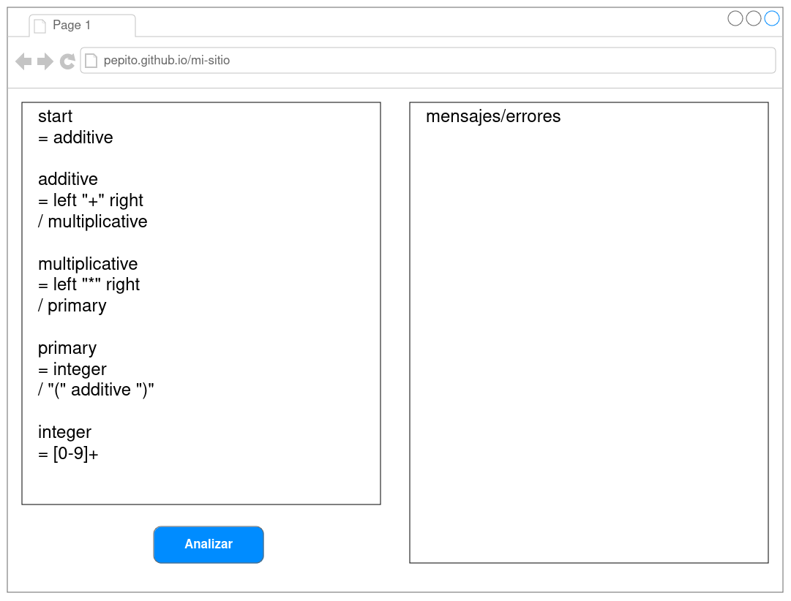

# FortranPEG
## Justificación
Debido a las recientes especificaciones modernas de Fortran, este ha tenido un crecimiento constante de popularidad en los dos últimos años según el índice Tiobe. Este crecimiento lo ha llevado de nuevo al Top 10 de lenguajes de programación ubicándolo en el octavo lugar. Por esta renovada popularidad se ha buscado la existencia de un generador de parser pero no se ha encontrado, por esto, como Escuela de Ciencias y Sistemas, se ha decido elaborar un proyecto de código abierto titulado FortranPEG.

## Objetivo de la Fase 1

Desarrollar un sitio web para la verificación de PEGs ([Parsing Expression Grammar](https://en.wikipedia.org/wiki/Parsing_expression_grammar)), capaz de detectar si la sintaxis de una PEG es correcta.

## Descripción
### Sitio web
Desarrollar un sitio web estático, donde por medio de una entrada de texto, pueda ingresar una PEG. Luego, el sitio web indicará si la sintaxis es correcta, o en caso contrario, los errores que encuentre al momento de analizar la entrada.
- Puede utilizar cualquier librería o framework frontend para generar la página web, o utlizar HTML/CSS/Javascript

#### Ejemplo de sitio web


### Github actions
Deberá utilizar github actions para publicar el sitio web a través de github pages. Al momento de la calificación se verificará la configuración de github actions.

### Reconocimiento de PEGs
Se utlizará [PeggyJS](https://peggyjs.org/documentation.html) para generar un parser capaz de reconocer PEGs.

Cada gramática es una serie de reglas, donde cada regla consta de un nombre y una *parsing expression*. La primera regla en la gramática será la regla inicial, con la que empezará el parseo.

Cada regla tiene la siguiente estructura:
```markdown
*identificador* = *expresión* ;
```

#### Notas de sintaxis
- Los identificadores están definidos por la expresión regular: [_a-z][_a-z0-9]*
- Las gramáticas son case sensitive
- Se pueden hacer comentarios con //(una linea) y /\*(multilinea)\*/
>[!IMPORTANT]
>Los espacios en blanco son sin importancia. Puede haber cualquier cantidad de espacios entre tokens

>[!NOTE]
>El ; se puede usar al final de una regla, pero es opcional

#### Expresiones reconocidas

"literal" \
"literal"i \
'literal' \
'literal'i \

Una cadena de texto que será tomada literalmente.
>[!NOTE]
>Agregar una "i" al final hará que el match sea case-insensitive (No reconoce entre mayusculas y minusculas)
```
Ejemplo: literal = "foo"
Cadena reconocida: foo
```
```
Ejemplo: literal = 'foo'
Cadena reconocida: foo
```
```
Ejemplo: literal = 'foo'i
Cadena(s) reconocidas: foo, Foo, FOO, FOo, fOo, FoO, etc.
```

[caracteres] \
[caracteres]i

Un conjunto de caracteres. Puede usarse un rango también, pero el primer caracter debe ser "menor" que el segundo caracter. Reconoce exactamente un caracter dentro del conjunto. **Cualquier caracter unicode en formato UTF-8**. También Deben ser reconocidos los caracteres de escape de UTF-8 (ej: \n,\t,\r).

Puede haber combinaciones de rangos y grupos de caracteres.
>[!NOTE]
>Agregar una "i" al final hará que el match sea case-insensitive (No reconoce entre mayusculas y minusculas)
```
Ejemplo: rango = [a-c]
Cadena(s) reconocidas: a, b, c
```
```
Ejemplo: conjunto = [abc0-3]
Cadena(s) reconocidas: a, b, c, 0, 1, 2, 3
```
```
Ejemplo: conjunto = [abc]i
Cadena(s) reconocidas: a, A, b, B, c, C
```

regla

Se refiere al nombre de otra regla en la gramática
```
Ejemplo: regla_1 = regla_2; regla_2 = "foo"
Cadena reconocia por regla1: foo
```

( *expresión* )

Reconoce una subexpresión
```
Ejemplo: grupo = ( "foo" )
Cadena reconocida: foo
```

*expresión* \*

Reconoce cero o más instancias de la expresión
```
Ejemplo: cero_o_mas = "foo" *
Cadena(s) reconocidas: *nada*, foo, foofoo, foofoofoo, etc.
```

*expresión* \+

Reconoce una o más instancias de la expresión
```
Ejemplo: una_o_mas = "foo" +
Cadena(s) reconocidas: foo, foofoo, foofoofoo, etc.
```

*expresión* ?

Reconoce cero o una instancia de la expresión
```
Ejemplo: regla = "foo" ?
Cadena(s) reconocidas: *nada*, foo
```

*expresión_1* *expresión_2* ... *expresión_n*

Reconoce una serie/concatenación de expresiones
```
Ejemplo: concatenacion = "foo" "bar" "baz"
Cadena reconocida: foobarbaz
```

*expresión_1* / *expresión_2* / ... / *expresión_n*

Trata de reconocer la primera expresión, si no es posible, continua con la segunda, etc.
```
Ejemplo: opciones = "foo" / "bar" / "baz"
Cadena(s) reconocidas: foo, bar, baz
```

. ("punto", caracter unicode U+002E)

Hace match exactamente con un caracter, incluyendo caracteres de espacio.
```
Ejemplo: regla = .
Cadena(s) reconocidas: "f", ".", " ","\ " etc.
```

!. (Fin de entrada de texto)

Hace match con el fin de la entrada de texto. Es decir, se reconoce como valida si se captura el final de la entrada de texto.
```
Ejemplo: no_input = !.
Cadena reconocida: "[EOI]"
```
```
Ejemplo: end_of_input = "f" !. //Trata de encontrar el final de la entrada de después de "f"
Cadena reocnocida: "f[EOI]"
```

*expression* |conteo| \
*expression* |min..max| \
*expression* |conteo, delimitador| \
*expression* |min..max, delimitador| \

Coincidir "conteo" número de repeticiones exactas de una expresión.

-o tambien-

Coincide con la expresión al menos "min" veces, pero no más de "max". Tanto "min" como "max" pueden omitirse. Si se omite "min", se supone que es 0. Si se omite "max", se supone que es infinito. Por lo tanto:

- la expresión |..| es equivalente a la expresión |0..| y la expresión *
- la expresión |1..| es equivalente a la expresión +
- la expresión |..1| es equivalente a la expresión ?

Opcionalmente, se puede especificar la expresión "delimitador". El "delimitador" es una expresión independiente del analizador sintáctico, sus resultados de coincidencia se ignoran y debe aparecer entre las expresiones coincidentes exactamente una vez.

"conteo", "min" y "max" pueden representarse como:

- enteros positivos:
> start = "a"|2|;
- nombre de una etiqueta precedente:
> start = count:n1 «a»|count|;
> n1 = n:$[0-9] { return parseInt(n); };

```
Ejemplo: repeticion = "a"|2..3, ","|
```

& *expresion*

Asersión positiva.
```
Ejemplo: asersion = "foo" &"bar"
```

! *expresion*

Asersión negativa.
```
Ejemplo: asersion = "foo" !"bar"
```

$ *expresion*

Retorna el texto de la expresión.
```
Ejemplo: texto = $"foo"
```

etiqueta : *expresion*

Asigna una etiqueta a una expresión. La etiqueta debe ser un identificador válido.
```
Ejemplo: regla = bar:"foo"
```

@ ( label :)? *expresion*

Operador "pluck". Puede ir acompañador de una etiqueta

```
Ejemplo: pluck = @"foo"
```
```
Ejemplo: pluck = @foo:"bar"
```

*nombre_de_regla* "Etiqueta de regla"

Asocia una etiqueta a una regla. La etiqueta va entre "";
```
Ejemplo:  regla "nombre de regla"
            = expresion
```

#### Ejemplo de gramática
```
// Simple Arithmetics Grammar
// ==========================
//
// Accepts expressions like "2 * (3 + 4)" and computes their value.

Expression
  = head:Term tail:(_ ("+" / "-") _ Term)*

Term
  = head:Factor tail:(_ ("*" / "/") _ Factor)*

Factor
  = "(" _ expr:Expression _ ")"
  / Integer

Integer "integer"
  = _ [0-9]

_ "whitespace"
  = [ \t\n\r]*
```

### Selección de mejores proyectos
En la calificación de cada fase, el mejor proyecto será seleccionado para ser agregado al repositorio de la escuela de ciencias y sistemas. Para la siguiente fase, todos los grupos deberán tomar como base el proyecto ganador de la fase anterior, y hacer un fork para desarrollar la siguiente fase. Esto se repetirá para cada fase, hasta completar el proyecto.

## Requerimientos

Para tener derecho a calificarse, deberá cumplir con los siguientes requerimientos:
- El proyecto debe utlizar la [licencia MIT](https://opensource.org/license/mit)
- Agregar al auxiliar al repositorio. Usuario [SaulCastel](github.com/SaulCastel)
- El sitio web debe ser publicado en github pages, utilizando github actions. **No se calificará el sitio web en su entorno local**. El uso de github actions es **obligatorio**
- En caso de usar Typescript, el código fuente subido al repositorio serán los archivos .ts
- Cada integrante del grupo deberá tener como mínimo un commit sustancial. Los commits serán revisados al momento de la calificación. Integrantes que no puedan demostrar su trabajo a través de el historial de commits tendrán una nota de cero
- Se penalizarán proyectos con commits fuera de la fecha y hora límite de entrega

**Es obligatorio realizar cada fase. No se tendrá derecho a calificación de las siguientes fases si no cumple con la entrega de las anteriores**

## Entregables

- Sitio web funcional, publicado en github pages a través de github actions
- Deberá entregar el link a su repositorio a través UEDI

**Fecha y hora límite de entrega: Domingo 12 de Diciembre a las 18:30 horas**