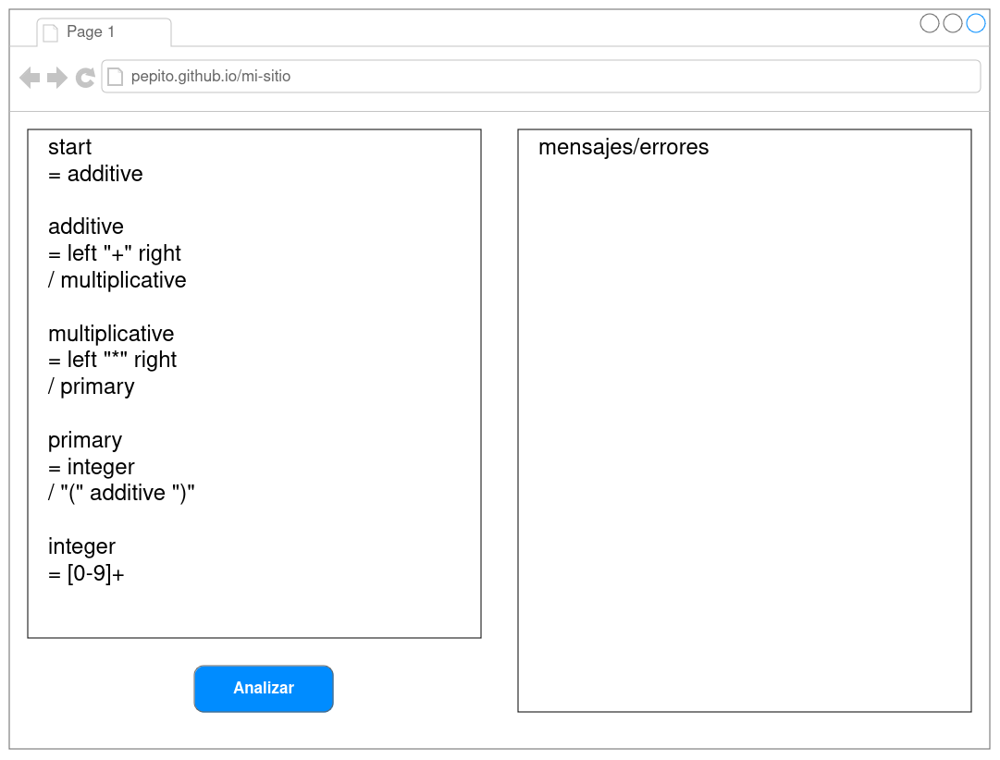

# FortranPEG
## Justificación
Debido a las recientes especificaciones modernas de Fortran, este ha tenido un crecimiento constante de popularidad en los dos últimos años según el índice Tiobe. Este crecimiento lo ha llevado de nuevo al Top 10 de lenguajes de programación ubicándolo en el octavo lugar. Por esta renovada popularidad se ha buscado la existencia de un generador de parser pero no se ha encontrado, por esto, como Escuela de Ciencias y Sistemas, se ha decido elaborar un proyecto de código abierto titulado FortranPEG.

## Objetivo de la Fase 1

Desarrollar un sitio web para la verificación de PEGs ([Parsing Expression Grammar](https://en.wikipedia.org/wiki/Parsing_expression_grammar)), capaz de detectar si la sintaxis de una PEG es correcta.

## Descripción
### Sitio web
Desarrollar un sitio web estático, donde por medio de una entrada de texto, pueda ingresar una PEG. Luego, el sitio web indicará si la sintaxis es correcta, o en caso contrario, los errores que encuentre al momento de analizar la entrada.
- Puede utilizar cualquier librería o framework frontend para generar la página web, o utlizar HTML/css/javascript

#### Ejemplo de sitio web


### Github actions
Deberá utilizar github actions para publicar el sitio web a través de github pages. Al momento de la calificación se verificará la configuración de github actions.

### Reconocimiento de PEGs
Se utlizará [PeggyJS](https://peggyjs.org/documentation.html) para generar un parser capaz de reconocer PEGs.

Cada gramática es una serie de reglas, donde cada regla consta de un nombre y una *parsing expression*. La primera regla en la gramática será la regla inicial, con la que empezará el parseo.

Cada regla tiene la siguiente estructura:
```markdown
*identificador* = *expresión*
```

- Las reglas pueden ser separadas por ; (Esto es opcional)

#### Expresiones reconocidas

"literal"
'literal'

Una cadena de texto que será tomada literalmente.
```
Ejemplo: literal = "foo"
Cadena reconocida: foo
```
```
Ejemplo: literal = 'foo'
Cadena reconocida: foo
```
\\

[caracteres]

Un conjunto de caracteres. Puede usarse un rango también. Reconoce exactamente un caracter dentro del conjunto. **Cualquier caracter unicode en formato UTF-8**
```
Ejemplo: rango = [a-c]
Cadena(s) reconocidas: a, b, c
```
```
Ejemplo: conjunto = [abc]
Cadena(s) reconocidas: a, b, c
```
\\

regla

Se refiere al nombre de otra regla en la gramática
```
Ejemplo: regla_1 = regla_2; regla_2 = "foo"
Cadena reconocia por regla1: foo
```
\\

( *expresión* )

Reconoce una subexpresión
```
Ejemplo: ( "foo" )
Cadena reconocida: foo
```
\\

*expresión* \*

Reconoce cero o más instancias de la expresión
```
Ejemplo: cero_o_mas = "foo" *
Cadena(s) reconocidas: *nada*, foo, foofoo, foofoofoo, etc.
```
\\

*expresión* \+

Reconoce una o más instancias de la expresión
```
Ejemplo: una_o_mas = "foo" +
Cadena(s) reconocidas: foo, foofoo, foofoofoo, etc.
```
\\

*expresión* ?

Reconoce cero o una instancia de la expresión
```
Ejemplo: regla = "foo" ?
Cadena(s) reconocidas: *nada*, foo
```
\\

*expresión_1* *expresión_2* ... *expresión_n*

Reconoce una serie/concatenación de expresiones
```
Ejemplo: concatenacion = "foo" "bar" "baz"
Cadena reconocida: foobarbaz
```
\\

*expresión_1* / *expresión_2* / ... / *expresión_n*

Trata de reconocer la primera expresión, si no es posible, continua con la segunda, etc.
```
Ejemplo: opciones: "foo" / "bar" / "baz"
Cadena(s) reconocidas: foo, bar, baz
```

#### Ejemplo de gramática
```
start
  = additive

additive
  = left "+" right
  / multiplicative

multiplicative
  = left "*" right
  / primary

primary
  = integer
  / "(" additive ")"

integer
  = [0-9]+
```

Esta gramática es capaz de reconocer entradas de la forma:
```
1 + 1
1 * 2
1 + ( 2 * 3)
```

## Requerimientos

Para tener derecho a calificarse, deberá cumplir con los siguientes requerimientos:

- Agregar al auxiliar al repositorio. Usuario [SaulCastel](github.com/SaulCastel)
- El sitio web debe ser publicado en github pages, utilizando github actions. **No se calificará el sitio web en su entorno local**. El uso de github actions es **obligatorio**
- En caso de usar Typescript, el código fuente subido al repositorio serán los archivos .ts
- Cada integrante del grupo deberá tener como mínimo un commit sustancial. Los commits serán revisados al momento de la calificación. Integrantes que no puedan demostrar su trabajo a través de el historial de commits tendrán una nota de cero
- Se penalizarán proyectos con commits fuera de la fecha y hora límite de entrega

**Es obligatorio realizar cada fase. No se tendrá derecho a calificación de las siguientes fases si no cumple con la entrega de las anteriores**

## Entregables

- Sitio web funcional, publicado en github pages a través de github actions
- Deberá entregar el link a su repositorio a través UEDI

**Fecha y hora límite de entrega: Domingo 08 de Diciembre a las 23:59 horas**
